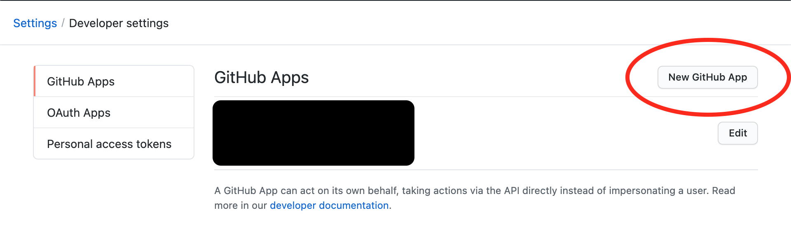
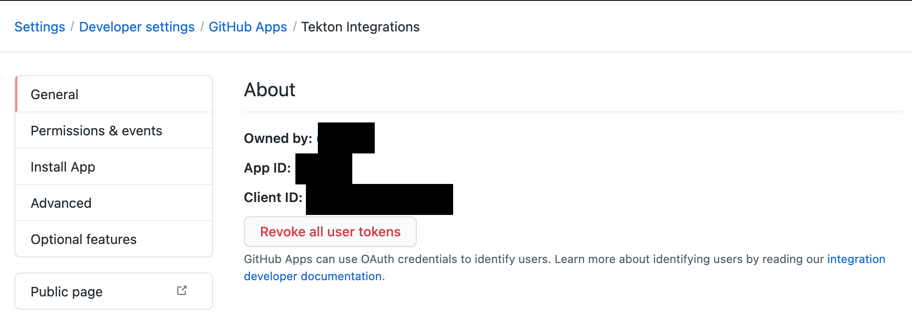
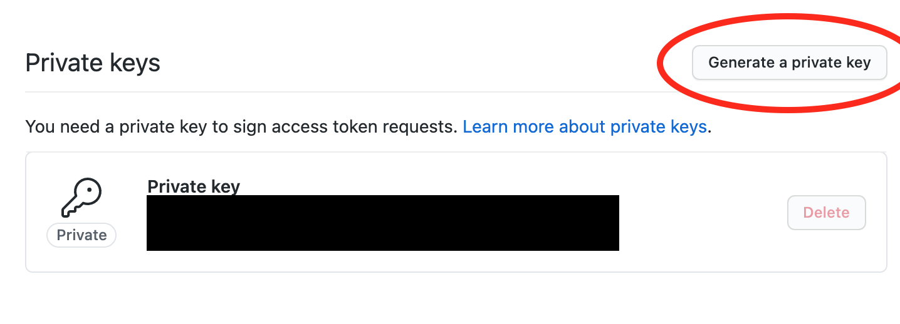
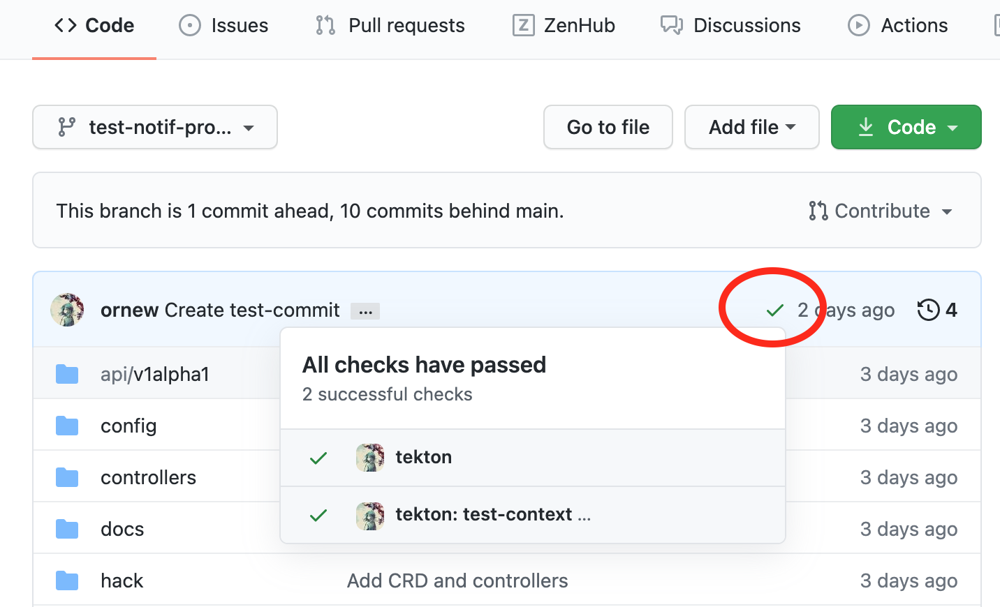

# GitHub App Integration

## Provider

```yaml
apiVersion: integrations.tekton.dev/v1alpha1
kind: Provider
metadata:
  name: github-app
  namespace: default
spec:
  type: GitHubApp
  githubApp:
    appId: 1
    privateKey:
      secretRef:
        name: github-app
```

## Features

- Sync TaskRun/PipelineRun Status to Commit Status
- Post the results of TaskRun/PipelineRun to PR

### Annotations

```yaml
apiVersion: tekton.dev/v1beta1
kind: PipelineRun
metadata:
  annotations:
    # default to pipelineRef.name
    integrations.tekton.ornew.io/context-id: "test-context"

    integrations.tekton.ornew.io/github-commit-status: "true"
    integrations.tekton.ornew.io/github-owner: "ornew"
    integrations.tekton.ornew.io/github-repo: "tekton-integration"
    integrations.tekton.ornew.io/github-sha: "8ebf2b9c0c8911077ad83c8c02c0a9a0345e7fd8"
```

## Setup

- Create a GitHub App and get an app ID
- Generate a private key
- Create a Secret for Providers
- Create a Provider
- Create a Notification
- Run with annotations

Open the [Settings > Developer settings](https://github.com/settings/apps) on GitHub.



Select `New GitHub App` and fill your app infomation.

You need to add the following permissions:

- Commit statuses: Read & write

After creating, make a note of the displayed App ID.



Create a private key. **Do not lose or publish the downloaded private key.**



Create a Secret for Providers.

```
SECRET_NAME=github-app

# required `private-key.pem`
kubectl create secret generic $SECRET_NAME --from-file=private-key.pem=/path/to/your-private-key.pem
```

Create a GitHubApp Provider.

```yaml
apiVersion: integrations.tekton.dev/v1alpha1
kind: Provider
metadata:
  name: github-app
spec:
  type: GitHubApp
  githubApp:
    appId: 1  # your app ID
    privateKey:
      secretRef:
        name: github-app  # your secret name
```

Create a Notification.

```yaml
apiVersion: integrations.tekton.ornew.io/v1alpha1
kind: Notification
metadata:
  name: github-app
spec:
  providerRef:
    name: github-app
```



Now when you annotate Run, it will set the status on GitHub.
